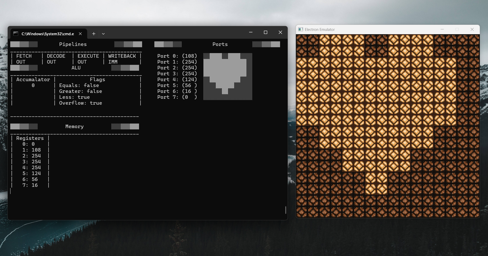
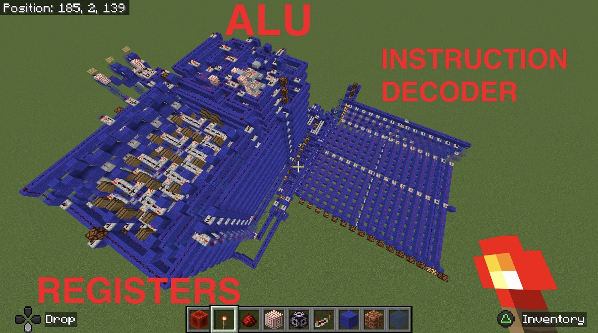
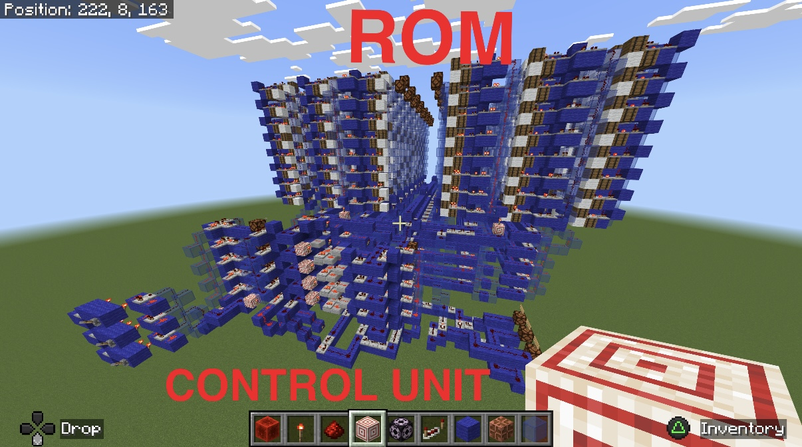
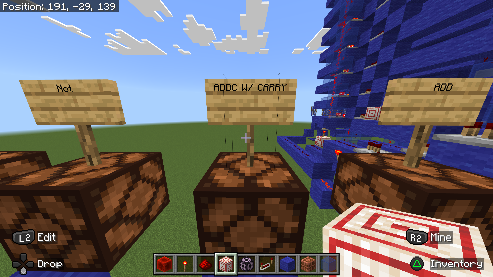
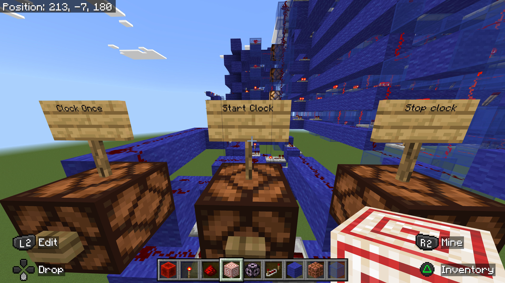
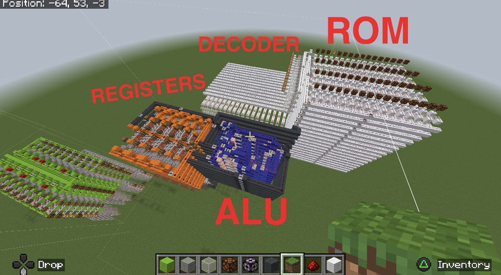
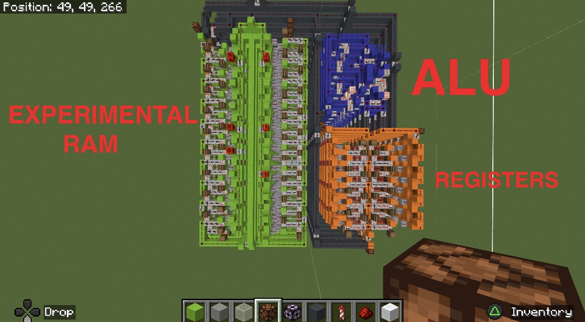

# Electron Redstone CPU Toolchain

**⚠️ QUICK ACCESS: The easiest way to run the Electron V2 Emulator is via the interactive Svelte component on my portfolio: [https://eliperez.dev](https://eliperez.dev).**

**The rest of this README describes the legacy Rust CLI and Raylib application. While you technically *can* run the V2 emulator using these legacy tools, it is highly recommended to use the web-based emulator on the portfolio site instead.**

This is a complete computer-architecture toolchain built from scratch in Rust. It supports two distinct custom CPU architectures:

1.  **Electron V1**: The original 8-bit RISC CPU, fully implemented in Minecraft.
2.  **Electron V2**: The advanced successor with a hardware stack, expanded instruction set, and new features.

This repository contains all components of the toolchain:

*   **The Assembler:** A compiler that translates custom Electron Assembly (`.elt`) into machine code for both architectures.
*   **The Emulator:** A Rust-based emulator with a `raylib-rs` GUI that runs the machine code for both V1 and V2.
*   **The VS Code Extension:** Provides full syntax highlighting for the Electron Assembly language.
*   **The Minecraft Implementation:** The original CPU design built using Redstone components in Minecraft.

---

## Architecture Comparison & Documentation

For comprehensive technical deep-dives into each architecture, please refer to their respective documentation files below.

| Feature | Electron V1 | Electron V2 |
| :--- | :--- | :--- |
| **Documentation** | [**ARCHITECTURE.md**](ARCHITECTURE.md) | [**ARCHITECTURE-v2.md**](ARCHITECTURE-v2.md) |
| **Status** | Completed & Built | Under Construction |
| **ROM** | 96 bytes (32 lines) | 256 Lines |
| **RAM** | None | 16 bytes (Shared with Stack) |
| **Registers** | 7 + Zero Register | 7 + Zero Register |
| **Stack** | Software Implementation | Hardware Stack (SP) |
| **Instructions** | 10 Basic Instructions | Expanded Set (`PUSH`, `POP`, `CALL`, `RET`, etc.) |
| **Pipeline** | 4-Stage Raw Pipeline | 4-Stage Raw Pipeline |

---

## Minecraft Redstone Implementation

The final Electron V1 CPU was designed and built from first principles using Redstone components within Minecraft. The entire computer and its variants exist on a PS4 minecraft world, hand made on controller with every block hand placed, and with no help from external programs or mods.


*See the [Gallery](#gallery) section below for more images of the Minecraft implementation.*

---

## Running the Toolchain

You can compile and run an assembly program in the Rust-based emulator with a single command. This will build the toolchain, assemble the `.elt` file, and launch the emulator GUI.

### Running Electron V1 (Default)

```sh

# Easiest
./electron -f heart.elt

# Assemble and run the fibonacci program in the emulator
cargo run -- -f fibonacci.elt

# Assemble and run the heart-drawing program
cargo run -- -f heart.elt

# Assemble and run with a specific clock speed (e.g., 10 Hz) using the -c flag
cargo run -- -f heart.elt -c 10

```

### Running Electron V2

To run programs using the Electron V2 emulator, add the `-v2` flag.

```sh
# Run a V2 program
cargo run -- -f my_program.elt -v2
```


## Emulator GUI

The emulator provides a visual interface to inspect the CPU's state, including registers, RAM, and the 8x8 display output.




## Electron V2 ISA & Tooling

The Electron V2 architecture represents a significant leap forward, introducing a hardware stack, an expanded instruction set, and 256 lines of ROM. For a detailed technical breakdown, please refer to [ARCHITECTURE-v2.md](ARCHITECTURE-v2.md).

While the legacy Rust CLI and Raylib application can technically run the V2 emulator (using the `-v2` flag as shown above), it is **much preferred** that you run the emulator via the Svelte component on my portfolio page: [https://eliperez.dev](https://eliperez.dev). The web version is much easier to use and accessible directly in your browser.


## The Electron v1 ISA & Tooling

The custom 8-bit Instruction Set Architecture (ISA) is **Turing-complete** and **inspired by MIPS** principles.

For a comprehensive technical deep-dive into the CPU architecture, instruction set, pipeline model, and programming guidelines, see the [ARCHITECTURE.md](ARCHITECTURE.md) documentation.


The emulator GUI is built with raylib-rs. To run it, you may need to install C/C++ dependencies from raylib-rs [here](https://github.com/raysan5/raylib/wiki).


### Electron-Lang: VS Code Extension

To make programming easier, a custom VS Code extension provides full syntax highlighting for `.elt` files.

**VS Code Installation:**

1. Open VS Code
2. Press `Ctrl+Shift+X` (or `Cmd+Shift+X` on macOS) to open Extensions
3. Click the `...` menu → Select **"Install from VSIX..."**
4. Navigate to `electron-lang/electron-language-0.0.1.vsix` and open it
5. Reload VS Code when prompted

**For detailed installation instructions** (including alternative methods and troubleshooting), see [`electron-lang/README.md`](electron-lang/README.md).


_Note: This syntax highlighting only works for the original Electron ISA, not the V2 ISA._


---

# Gallery

Below is a complete gallery of the Minecraft Redstone CPU implementations:

## Electron:









## Experimental Designs:




